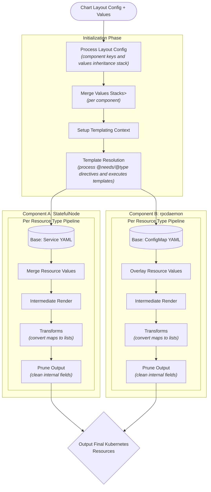

# Common Helm Chart

[](https://opensource.org/licenses/Apache-2.0)   

# Common Chart

A Helm library chart providing a framework for generating Kubernetes resources with advanced templating and layered value inheritance for single and multi-component charts.

## Overview

This library chart enables:
- Component-based resource generation
- Layered value inheritance
- Advanced template processing
- Generalized ability to override-anything
- Automatic map-to-list transformations for more conveniet values interfaces
- Standardized resource generation patterns

## Usage

### 1. Include it as Dependency

```yaml
# Chart.yaml
dependencies:
  - name: common
```

### 2. Configure Components

Configuation is done by creating a file named `_common.config.yaml` in the root of your chart.
Components can be configured in three modes:

#### Single Component

```yaml
# _common.config.yaml
dynamicComponents: false

components:
  - myComponent

componentLayering:
  myComponent: []
```

which decleares a top level key `myComponent` for a single component, and no keys from which to inherit defaults.
Even for a single component, you may wish to have a separate key from which to inherit defaults just to leave the main top level key a bit cleaner for the user, i.e.:

```yaml
# _common.config.yaml
dynamicComponents: false

components:
  - myComponent

componentLayering:
  myComponent:
    - myComponentDefaults
```

#### Multiple Static Components

```yaml
# _common.config.yaml
dynamicComponents: false

components:
  - statefulNode
  - rpcdaemon

componentLayering:
  statefulNode:
    - erigonDefaults
  rpcdaemon:
    - erigonDefaults

```

This defines two separate components, `statefulNode` and `rpcdaemon`, both of which inherit common defaults from an `erigonDefaults` key.

#### Dynamic Components

```yaml
# _common.config.yaml
dynamicComponents: true

componentsKey: <Top Level key expected to have components as subkeys>

componentLayering: '{{ Templating Logic that generates componentLayering based dinamically }}
```

### 3. Define Values

Structure your values in layers that match your inheritance configuration:

```yaml
# values.yaml
defaults:
  resources:
```

### 4. Template References

Components can reference values from other components using `@needs` directive:

```yaml
rpcdaemon:
  config: |
    @needs(ComponentValues.statefulnode.ports[0].containerPort as nodePort)
```

## Architecture

The chart processes resources through several phases:

1. **Initialization**
   - Processes component configuration and inheritance stacks
   - Merges values according to defined layers
   - Setup Templating Context
   - Template resolution on values, with preprocessor directives (@needs, @type, ...)

2. **Per-Component Resource Generation**
   - Starts with base resource templates
   - Overlays component-specific values
   - Does an intermediate render with resolved context
   - Applies resource transformations (convert back maps to lists)
   - Prunes output of internal or disabled fields
   - Prints final resources render



## Upgrading

We recommend that you pin the version of the Chart that you deploy. You can use the `--version` flag with `helm install` and `helm upgrade` to specify a chart version constraint.

This project uses [Semantic Versioning](https://semver.org/). Changes to the version of the application (the `appVersion`) that the Chart deploys will generally result in a patch version bump for the Chart. Breaking changes to the Chart or its `values.yaml` interface will be reflected with a major version bump.

We do not recommend that you upgrade the application by overriding `image.tag`. Instead, use the version of the Chart that is built for your desired `appVersion`.

## Contributing

We welcome and appreciate your contributions! Please see the [Contributor Guide](/CONTRIBUTING.md), [Code Of Conduct](/CODE_OF_CONDUCT.md) and [Security Notes](/SECURITY.md) for this repository.
