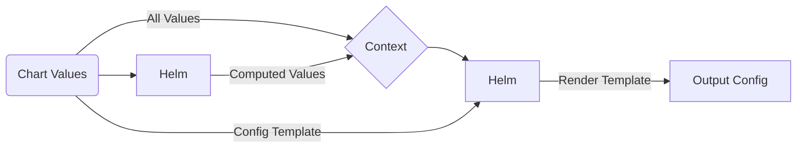

# Graph-Node Helm Chart

Deploy and scale [Graph Node](https://github.com/graphprotocol/graph-node) inside Kubernetes with ease

[](https://opensource.org/licenses/Apache-2.0)   

## Introduction

TODO
- write brief intro to graph-node
- finish initial docs
- add dashboards to chart
- move toolbox into separate chart

## Chart Features

- Actively maintained by [GraphOps](https://graphops.xyz) [and contributors](https://github.com/graphops/helm-charts/graphs/contributors)
- Strong security defaults (non-root execution, ready-only root filesystem, drops all capabilities)
- Readiness checks to ensure traffic only hits `Pod`s that are healthy and ready to serve requests
- Support for `ServiceMonitor`s to configure Prometheus to scrape metrics ([prometheus-operator](https://github.com/prometheus-operator/prometheus-operator))
- Support for configuring Grafana dashboards ([grafana](https://github.com/grafana/helm-charts/tree/main/charts/grafana))
- Easily define groups of Graph Nodes and split responsibilities across them

## Quickstart

To install the chart with the release name `my-release`:

```console
$ helm repo add graphops http://graphops.github.io/helm-charts
$ helm install my-release graphops/graph-node
```

## Configuring graph-node

This chart uses [`config.toml` to configure Graph Node](https://github.com/graphprotocol/graph-node/blob/master/docs/config.md). The Chart uses your [Values](#Values), as well as a [configuration template](#advanced-configuration), to render a `config.toml`. This approach provides a great out of the box experience, while providing flexibility for power users to generate customised configuration for highly advanced configurations of Graph Node.

### Graph Node Groups

Graph Node supports being deployed in a wide variety of configurations. In the most simple case, you can have a single instance of Graph Node that is responsible for all tasks, including block ingestion, indexing subgraphs and serving queries. More advanced users might separate out each task into a dedicated group of Graph Nodes. Operators indexing many blockchains can even deploy a dedicated group of indexing Graph Nodes for each blockchain.

Groups are defined in values.yaml (see [Values](#Values)) under the `groupNodeGroups` key. Default configuration which will be applied to all groups can be set under the `graphNodeDefaults` key. Values in group-specific configuration will take precedence over those present in the default configuration.

Example of configuration for single Graph Node instance that performs all tasks:

```yaml
TODO
```

Example of a more advanced configuration:

```yaml
TODO
```

### Configuring PostgreSQL backend

TODO

#### Sharding with multiple PostgreSQL backends

TODO

### Subgraph Deployment Rules

#### Automatic Node IDs

Graph Node instances are assigned an ID, allowing subgraphs to be assigned to a particular instance.

This Chart deploys Graph Node using Kubernetes `StatefulSet`s, providing a consistent naming scheme for all `Pod`s. This is the basis for Node ID generation.

The Node ID template follows the format: `<release-name>_<group-name>_<index>`, where index is an integer indicating the node number in that group, with the first node having the index of `0`. All instances of `-` are replaced with `_` to conform with `graph-node` naming requirements. Note: This will change if/when `graph-node` allows `-` in Node IDs.

### Advanced Configuration

This Chart uses a template to allow customisation of the configuration passed into the application. The template is rendered by Helm, so you can use [Go templating](https://golangdocs.com/templates-in-golang) as well as [Helm context built-ins](https://helm.sh/docs/chart_template_guide/builtin_objects) to customise the configuration. This includes accessing and looping over any values that you pass into the Helm release.

The template is defined under the `configTemplate` key in the [Values](#Values). You can override this value to specify your custom template.

The Chart also computes additional values that are appended to the template context. You can use these in your template too. See more below.

This diagram describes how this template is used to generate of the output configuration.



### Computed Template Variables

The following additional template variables are computed and injected into the template context under the `computed` key:

- `indexPools` - a `dict` of `index_pool_name -> [graph_node_id1, graph_node_id2, graph_node_id3]`

You can use these keys in your custom configuration template (e.g. `{{ .computed.computedValue }}`).

#### Index Pools

## Upgrading

We recommend that you pin the version of the Chart that you deploy. You can use the `--version` flag with `helm install` and `helm upgrade` to specify a chart version constraint.

This project uses [Semantic Versioning](https://semver.org/). Changes to the version of the application (the `appVersion`) that the Chart deploys will generally result in a patch version bump for the Chart. Breaking changes to the Chart or its `values.yaml` interface will be reflected with a major version bump.

We do not recommend that you upgrade the application by overriding `image.tag`. Instead, use the version of the Chart that is built for your desired `appVersion`.

## Values

| Key | Description | Type | Default |
|-----|-------------|------|---------|
 | configTemplate | [Configuration for graph-node](https://github.com/graphprotocol/graph-node/blob/master/docs/config.md) | string | `"[store]\n[store.primary]\nconnection = \"postgresql://${PGUSER}:${PGPASSWORD}@${PGHOST}:${PGPORT}/${PGDATABASE}\"\n# weight = 0\npool_size = 10\n[chains]\ningestor = \"{{ .Release.Name }}-block-ingestor-0\"\n[chains.mainnet]\nshard = \"primary\"\nprovider = [\n  { label = \"eth-mainnet\", url = \"${ETH_MAINNET_RPC_URL}\", features = [ \"archive\", \"traces\" ] }\n]\n[deployment]\n# Deployment rules match top to bottom\n[[deployment.rule]]\n# DEFAULT RULE\n# There's no 'match' field, so any subgraph that hasn't matched above, matches this rule\nshards = [\"primary\"]\nindexers = {{ toJson .computed.indexPools.default }}\n"` |
 | fullnameOverride |  | string | `""` |
 | grafana.dashboards | Enable creation of Grafana dashboards. [Grafana chart](https://github.com/grafana/helm-charts/tree/main/charts/grafana#grafana-helm-chart) must be configured to search this namespace, see `sidecar.dashboards.searchNamespace` | bool | `false` |
 | grafana.dashboardsConfigMapLabel | Must match `sidecar.dashboards.label` value for the [Grafana chart](https://github.com/grafana/helm-charts/tree/main/charts/grafana#grafana-helm-chart) | string | `"grafana_dashboard"` |
 | grafana.dashboardsConfigMapLabelValue | Must match `sidecar.dashboards.labelValue` value for the [Grafana chart](https://github.com/grafana/helm-charts/tree/main/charts/grafana#grafana-helm-chart) | string | `""` |
 | graphNodeDefaults.affinity |  | object | `{}` |
 | graphNodeDefaults.affinityPresets.antiAffinityByHostname |  | bool | `true` |
 | graphNodeDefaults.enabled |  | bool | `true` |
 | graphNodeDefaults.env.ETH_MAINNET_RPC_URL |  | string | `nil` |
 | graphNodeDefaults.env.PGDATABASE |  | string | `nil` |
 | graphNodeDefaults.env.PGHOST |  | string | `nil` |
 | graphNodeDefaults.env.PGPORT |  | int | `5432` |
 | graphNodeDefaults.extraArgs | Additional CLI arguments to pass to Graph Node | list | `[]` |
 | graphNodeDefaults.includeInIndexPools |  | list | `[]` |
 | graphNodeDefaults.nodeSelector |  | object | `{}` |
 | graphNodeDefaults.podAnnotations | Annotations for the `Pod` | object | `{}` |
 | graphNodeDefaults.podSecurityContext | Pod-wide security context | object | `{"fsGroup":101337,"runAsGroup":101337,"runAsNonRoot":true,"runAsUser":101337}` |
 | graphNodeDefaults.replicaCount |  | int | `1` |
 | graphNodeDefaults.resources |  | object | `{}` |
 | graphNodeDefaults.secretEnv.PGPASSWORD.key |  | string | `"password"` |
 | graphNodeDefaults.secretEnv.PGPASSWORD.secretName |  | string | `"postgres-config"` |
 | graphNodeDefaults.secretEnv.PGUSER.key |  | string | `"username"` |
 | graphNodeDefaults.secretEnv.PGUSER.secretName |  | string | `"postgres-config"` |
 | graphNodeDefaults.service.ports.http-admin | Service Port to expose Graph Node Admin endpoint on | int | `8020` |
 | graphNodeDefaults.service.ports.http-metrics | Service Port to expose Graph Node Metrics endpoint on | int | `8040` |
 | graphNodeDefaults.service.ports.http-query | Service Port to expose Graph Node Query endpoint on | int | `8000` |
 | graphNodeDefaults.service.ports.http-queryws | Service Port to expose Graph Node Websocket Query endpoint on | int | `8001` |
 | graphNodeDefaults.service.ports.http-status | Service Port to expose Graph Node Status endpoint on | int | `8030` |
 | graphNodeDefaults.service.type |  | string | `"ClusterIP"` |
 | graphNodeDefaults.terminationGracePeriodSeconds | Amount of time to wait before force-killing the Erigon process | int | `60` |
 | graphNodeDefaults.tolerations |  | list | `[]` |
 | graphNodeGroups.block-ingestor.env.NODE_ROLE |  | string | `"index-node"` |
 | graphNodeGroups.block-ingestor.includeInIndexPools |  | list | `[]` |
 | graphNodeGroups.block-ingestor.replicaCount |  | int | `1` |
 | image.pullPolicy |  | string | `"IfNotPresent"` |
 | image.repository | Image for Graph Node | string | `"graphprotocol/graph-node"` |
 | image.tag | Overrides the image tag | string | Chart.appVersion |
 | imagePullSecrets | Pull secrets required to fetch the Image | list | `[]` |
 | nameOverride |  | string | `""` |
 | prometheus.serviceMonitors.enabled | Enable monitoring by creating `ServiceMonitor` CRDs ([prometheus-operator](https://github.com/prometheus-operator/prometheus-operator)) | bool | `false` |
 | prometheus.serviceMonitors.interval |  | string | `nil` |
 | prometheus.serviceMonitors.labels |  | object | `{}` |
 | prometheus.serviceMonitors.relabelings |  | list | `[]` |
 | prometheus.serviceMonitors.scrapeTimeout |  | string | `nil` |
 | serviceAccount.annotations | Annotations to add to the service account | object | `{}` |
 | serviceAccount.create | Specifies whether a service account should be created | bool | `true` |
 | serviceAccount.name | The name of the service account to use. If not set and create is true, a name is generated using the fullname template | string | `""` |
 | toolbox.affinity |  | object | `{}` |
 | toolbox.enabled | Enable deployment of a toolbox container containing preconfigured tools to interact with graph-node and the database | bool | `true` |
 | toolbox.env |  | object | `{}` |
 | toolbox.image.pullPolicy |  | string | `"IfNotPresent"` |
 | toolbox.image.repository |  | string | `"graphprotocol/graph-node"` |
 | toolbox.image.tag | Overrides the image tag | string | `""` |
 | toolbox.nodeSelector |  | object | `{}` |
 | toolbox.podAnnotations |  | object | `{}` |
 | toolbox.podSecurityContext | Pod-wide security context | object | `{"fsGroup":101337,"runAsGroup":101337,"runAsNonRoot":true,"runAsUser":101337}` |
 | toolbox.resources |  | object | `{}` |
 | toolbox.secretEnv |  | object | `{}` |
 | toolbox.tolerations |  | list | `[]` |

## Contributing

We welcome and appreciate your contributions! Please see the [Contributor Guide](/CONTRIBUTING.md), [Code Of Conduct](/CODE_OF_CONDUCT.md) and [Security Notes](/SECURITY.md) for this repository.
