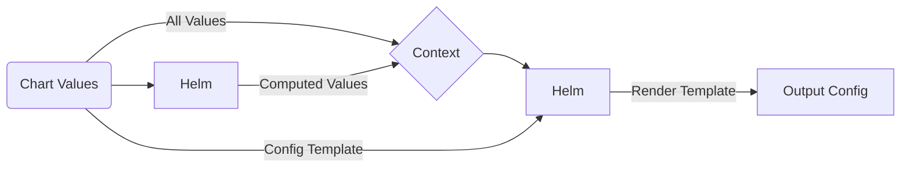

# Graph-Node Helm Chart

Deploy and scale [Graph Node](https://github.com/graphprotocol/graph-node) inside Kubernetes with ease

[](https://opensource.org/licenses/Apache-2.0)   

## Introduction

[Graph Node](https://github.com/graphprotocol/graph-node) is key component of [The Graph](https://thegraph.com), a decentralised blockchain data protocol. Graph Node supports executing [Subgraphs](https://thegraph.com/docs/en/developing/creating-a-subgraph/) to extract, process and index blockchain data. It also provides a rich GraphQL query interface to inspect and interrogate this data. [Learn more](https://github.com/graphprotocol/graph-node/blob/master/docs/getting-started.md).

## Chart Features

- Actively maintained by [GraphOps](https://graphops.xyz) [and contributors](https://github.com/graphops/helm-charts/graphs/contributors)
- Strong security defaults (non-root execution, ready-only root filesystem, drops all capabilities)
- Readiness checks to ensure traffic only hits `Pod`s that are healthy and ready to serve requests
- Support for `ServiceMonitor`s to configure Prometheus to scrape metrics ([prometheus-operator](https://github.com/prometheus-operator/prometheus-operator))
- Support for configuring Grafana dashboards ([grafana](https://github.com/grafana/helm-charts/tree/main/charts/grafana))
- Easily define groups of Graph Nodes and split responsibilities across them

## Quickstart

To install the chart with the release name `my-release`:

```console
$ helm repo add graphops http://graphops.github.io/helm-charts
$ helm install my-release graphops/graph-node
```

## Configuring graph-node

This chart uses [`config.toml` to configure Graph Node](https://github.com/graphprotocol/graph-node/blob/master/docs/config.md). The Chart uses your [Values](#Values), as well as a [configuration template](#advanced-configuration), to render a `config.toml`. This approach provides a great out of the box experience, while providing flexibility for power users to generate customised configuration for highly advanced configurations of Graph Node.

### Graph Node Groups

Graph Node supports being deployed in a wide variety of configurations. In the most simple case, you can have a single instance of Graph Node that is responsible for all tasks, including block ingestion, indexing subgraphs and serving queries. More advanced users might separate out each task into a dedicated group of Graph Nodes. Operators indexing many blockchains can even deploy a dedicated group of indexing Graph Nodes for each blockchain.

Groups are defined in your `values.yaml` (see [Values](#Values)) under the `groupNodeGroups` key. Default configuration which will be applied to all groups can be set under the `graphNodeDefaults` key. Values in group-specific configuration will take precedence over those present in the default configuration.

#### Default Group Configuration

By default, the chart defines three Graph Node Groups:

1. `block-ingestor`, with a `replicaCount` of `1`, which is also configured in the [configuration template](#advanced-configuration) as the block ingestor node
1. `index`, with a `replicaCount` of `1`, which is configured as an `index-node`, and included in the `default` [Index Pool for subgraph deployment purposes](#subgraph-deployment-rules)
1. `query`, with a `replicaCount` of `1`, which is configured as a `query-node`

See [Values](#Values) for how to scale these groups and apply other configuration. You can also disable these groups to define more advanced grouping configuration.

Kubernetes `Service`s are provisioned for each group to allow load balancing and failover for nodes in that group.

#### Customising Groups

You can disable default groups and define your own.

<details>
  <summary><strong>Groups Config Example</strong>: Single combined Graph Node that performs all functions</summary>

  ```yaml
  graphNodeDefaults:
    env:
      ETH_MAINNET_RPC_URL: https://my_eth_node:8545
      IPFS: "https://ipfs.network.thegraph.com"
      PGDATABASE: graph
      PGHOST: my-pg-host

    secretEnv:   
      PGUSER:
        secretName: postgres-config
        key: username
      PGPASSWORD:
        secretName: postgres-config
        key: password

  graphNodeGroups:
    combined:
      enabled: true
      replicaCount: 1
      includeInIndexPools:
        - default
      env:
        NODE_ROLE: combined-mode
  blockIngestorGroupName: combined # we must override this because the default value assumes a dedicated block-ingestor group
  ```
</details>

<details>
  <summary><strong>Groups Config Example</strong>: Separated block ingestor, index nodes, query nodes, with dedicated groups for debugging subgraph indexing and VIP subgraph deployments</summary>

  ```yaml
  graphNodeDefaults:
    env:
      ETH_MAINNET_RPC_URL: https://my_eth_node:8545
      PGDATABASE: graph
      PGHOST: my-pg-host

    secretEnv:   
      PGUSER:
        secretName: postgres-config
        key: username
      PGPASSWORD:
        secretName: postgres-config
        key: password

  graphNodeGroups:
    block-ingestor:
      enabled: true
      replicaCount: 1
      includeInIndexPools: [] # do not index any subgraphs on the block ingestor
      env:
        NODE_ROLE: index-node
    index:
      enabled: true
      replicaCount: 10
      includeInIndexPools:
        - default
      env:
        NODE_ROLE: index-node
    index-vip:
      enabled: true
      replicaCount: 2
      includeInIndexPools: [] # don't deploy here by default, rely on manual assignment
      nodeSelector:
        my_high_performance_node_label: "true"
      env:
        NODE_ROLE: index-node
        ETH_MAINNET_RPC_URL: https://high_performance_rpc_provider:8545
    index-debug:
      enabled: true
      replicaCount: 1
      includeInIndexPools: [] # don't deploy here by default, rely on manual assignment
      env:
        NODE_ROLE: index-node
        RUST_LOG: trace
        GRAPH_LOG: trace
    query:
      enabled: true
      replicaCount: 3
      env:
        NODE_ROLE: query-node
  ```

  In this example, subgraph deployments could be manually reassigned to a `index-debug` node to extract trace index logs, or to a `index-vip` node to run on a VIP node pointing at a higher performance JSON-RPC endpoint.
</details>

### Subgraph Deployment Rules

By default, the configuration template defines a single subgraph deployment rule that assigns all subgraphs to the set of nodes defined by the `default` index pool.

#### Index Pools

An Index Pool is a set of Graph Nodes (an array of [Node ID](#automatic-node-ids)s) that are grouped together for subgraph indexing purposes. You can include a Graph Node Group and its nodes in an Index Pool by specifying the pool name in that Group's `includeInIndexPools` configuration.

The Chart automatically generates Index Pools basic on the Group configuration you specify in [Values](#Values).

#### Automatic Node IDs

Graph Node instances are assigned an ID, allowing subgraphs to be assigned to a particular instance.

This Chart deploys Graph Node using Kubernetes `StatefulSet`s, providing a consistent naming scheme for all `Pod`s. This is the basis for Node ID generation.

The Node ID template follows the format: `<release-name>-<group-name>-<index>`, where index is an integer indicating the node number in that group, with the first node having the index of `0`.

### Advanced Configuration

This Chart uses a template to allow customisation of the configuration passed into the application. The template is rendered by Helm, so you can use [Go templating](https://golangdocs.com/templates-in-golang) as well as [Helm context built-ins](https://helm.sh/docs/chart_template_guide/builtin_objects) to customise the configuration. This includes accessing and looping over any values that you pass into the Helm release.

The template is defined under the `configTemplate` key in the [Values](#Values). You can override this value to specify your custom template.

The Chart also computes additional values that are appended to the template context. You can use these in your template too. See more below.

This diagram describes how this template is used to generate of the output configuration.



### Computed Template Variables

The following additional template variables are computed and injected into the template context under the `computed` key:

- `indexPools` - a `dict` of `index_pool_name -> [graph_node_id1, graph_node_id2, graph_node_id3]`

You can use these keys in your custom configuration template (e.g. `{{ .computed.computedValue }}`).

## Upgrading

We recommend that you pin the version of the Chart that you deploy. You can use the `--version` flag with `helm install` and `helm upgrade` to specify a chart version constraint.

This project uses [Semantic Versioning](https://semver.org/). Changes to the version of the application (the `appVersion`) that the Chart deploys will generally result in a patch version bump for the Chart. Breaking changes to the Chart or its `values.yaml` interface will be reflected with a major version bump.

We do not recommend that you upgrade the application by overriding `image.tag`. Instead, use the version of the Chart that is built for your desired `appVersion`.

## Values

| Key | Description | Type | Default |
|-----|-------------|------|---------|
 | blockIngestorGroupName | Name of the Graph Node Group that should be the block ingestor. Only the first node instance (with index 0) will be configured as the block ingestor. | string | `"block-ingestor"` |
 | configTemplate | [Configuration for graph-node](https://github.com/graphprotocol/graph-node/blob/master/docs/config.md) | string | See default template in [values.yaml](values.yaml) |
 | fullnameOverride |  | string | `""` |
 | grafana.dashboards | Enable creation of Grafana dashboards. [Grafana chart](https://github.com/grafana/helm-charts/tree/main/charts/grafana#grafana-helm-chart) must be configured to search this namespace, see `sidecar.dashboards.searchNamespace` | bool | `false` |
 | grafana.dashboardsConfigMapLabel | Must match `sidecar.dashboards.label` value for the [Grafana chart](https://github.com/grafana/helm-charts/tree/main/charts/grafana#grafana-helm-chart) | string | `"grafana_dashboard"` |
 | grafana.dashboardsConfigMapLabelValue | Must match `sidecar.dashboards.labelValue` value for the [Grafana chart](https://github.com/grafana/helm-charts/tree/main/charts/grafana#grafana-helm-chart) | string | `""` |
 | graphNodeDefaults | Default values for all Group Node Groups | object | `{"affinity":{},"affinityPresets":{"antiAffinityByHostname":true},"enabled":true,"env":{"ETH_MAINNET_RPC_URL":"","IPFS":"","PGDATABASE":"","PGHOST":"","PGPORT":5432},"extraArgs":[],"includeInIndexPools":[],"nodeSelector":{},"podAnnotations":{},"podSecurityContext":{"fsGroup":101337,"runAsGroup":101337,"runAsNonRoot":true,"runAsUser":101337},"replicaCount":1,"resources":{},"secretEnv":{"PGPASSWORD":{"key":null,"secretName":null},"PGUSER":{"key":null,"secretName":null}},"service":{"ports":{"http-admin":8020,"http-metrics":8040,"http-query":8000,"http-queryws":8001,"http-status":8030},"type":"ClusterIP"},"terminationGracePeriodSeconds":60,"tolerations":[]}` |
 | graphNodeDefaults.affinityPresets.antiAffinityByHostname | Create anti-affinity rule to deter scheduling replicas on the same host | bool | `true` |
 | graphNodeDefaults.enabled | Enable the group | bool | `true` |
 | graphNodeDefaults.env | Environment variable defaults for all Graph Node groups | object | `{"ETH_MAINNET_RPC_URL":"","IPFS":"","PGDATABASE":"","PGHOST":"","PGPORT":5432}` |
 | graphNodeDefaults.env.ETH_MAINNET_RPC_URL | The URL for your Ethereum Mainnet Archive Node | string | `""` |
 | graphNodeDefaults.env.IPFS | The URL for your IPFS node | string | `""` |
 | graphNodeDefaults.env.PGDATABASE | Name of the database to use | string | `""` |
 | graphNodeDefaults.env.PGHOST | Hostname of your PostgreSQL server | string | `""` |
 | graphNodeDefaults.env.PGPORT | Port for your PostgreSQL server | int | `5432` |
 | graphNodeDefaults.extraArgs | Additional CLI arguments to pass to Graph Node | list | `[]` |
 | graphNodeDefaults.includeInIndexPools | List of Index Pools to include nodes in the group in | list | `[]` |
 | graphNodeDefaults.nodeSelector | Specify a [node selector](https://kubernetes.io/docs/concepts/scheduling-eviction/assign-pod-node/) | object | `{}` |
 | graphNodeDefaults.podAnnotations | Annotations for the `Pod` | object | `{}` |
 | graphNodeDefaults.podSecurityContext | Pod-wide security context | object | `{"fsGroup":101337,"runAsGroup":101337,"runAsNonRoot":true,"runAsUser":101337}` |
 | graphNodeDefaults.replicaCount | The number of nodes to run in the group | int | `1` |
 | graphNodeDefaults.resources | Specify [resource requests and limits](https://kubernetes.io/docs/concepts/configuration/manage-resources-containers/#requests-and-limits) for each node in the group | object | `{}` |
 | graphNodeDefaults.secretEnv | Environment variable defaults that come from `Secret`s for all Graph Node groups | object | `{"PGPASSWORD":{"key":null,"secretName":null},"PGUSER":{"key":null,"secretName":null}}` |
 | graphNodeDefaults.secretEnv.PGPASSWORD.key | Name of the data key in the secret that contains your PG password | string | `nil` |
 | graphNodeDefaults.secretEnv.PGPASSWORD.secretName | Name of the secret that contains your PG password | string | `nil` |
 | graphNodeDefaults.secretEnv.PGUSER.key | Name of the data key in the secret that contains your PG username | string | `nil` |
 | graphNodeDefaults.secretEnv.PGUSER.secretName | Name of the secret that contains your PG username | string | `nil` |
 | graphNodeDefaults.service.ports.http-admin | Service Port to expose Graph Node Admin endpoint on | int | `8020` |
 | graphNodeDefaults.service.ports.http-metrics | Service Port to expose Graph Node Metrics endpoint on | int | `8040` |
 | graphNodeDefaults.service.ports.http-query | Service Port to expose Graph Node Query endpoint on | int | `8000` |
 | graphNodeDefaults.service.ports.http-queryws | Service Port to expose Graph Node Websocket Query endpoint on | int | `8001` |
 | graphNodeDefaults.service.ports.http-status | Service Port to expose Graph Node Status endpoint on | int | `8030` |
 | graphNodeDefaults.terminationGracePeriodSeconds | Amount of time to wait before force-killing the Erigon process | int | `60` |
 | graphNodeDefaults.tolerations | Specify [tolerations](https://kubernetes.io/docs/concepts/scheduling-eviction/taint-and-toleration/) | list | `[]` |
 | graphNodeGroups | Groups of Graph Nodes to deploy | object | `{"block-ingestor":{"enabled":true,"env":{"NODE_ROLE":"index-node"},"includeInIndexPools":[],"replicaCount":1},"index":{"enabled":true,"env":{"NODE_ROLE":"index-node"},"includeInIndexPools":["default"],"replicaCount":1},"query":{"enabled":true,"env":{"NODE_ROLE":"query-node"},"replicaCount":1}}` |
 | image.pullPolicy |  | string | `"IfNotPresent"` |
 | image.repository | Image for Graph Node | string | `"graphprotocol/graph-node"` |
 | image.tag | Overrides the image tag | string | Chart.appVersion |
 | imagePullSecrets | Pull secrets required to fetch the Image | list | `[]` |
 | nameOverride |  | string | `""` |
 | prometheus.serviceMonitors.enabled | Enable monitoring by creating `ServiceMonitor` CRDs ([prometheus-operator](https://github.com/prometheus-operator/prometheus-operator)) | bool | `false` |
 | prometheus.serviceMonitors.interval |  | string | `nil` |
 | prometheus.serviceMonitors.labels |  | object | `{}` |
 | prometheus.serviceMonitors.relabelings |  | list | `[]` |
 | prometheus.serviceMonitors.scrapeTimeout |  | string | `nil` |
 | serviceAccount.annotations | Annotations to add to the service account | object | `{}` |
 | serviceAccount.create | Specifies whether a service account should be created | bool | `true` |
 | serviceAccount.name | The name of the service account to use. If not set and create is true, a name is generated using the fullname template | string | `""` |

## Contributing

We welcome and appreciate your contributions! Please see the [Contributor Guide](/CONTRIBUTING.md), [Code Of Conduct](/CODE_OF_CONDUCT.md) and [Security Notes](/SECURITY.md) for this repository.

## See also

- [Erigon](../erigon)
- [Proxyd](../proxyd)
