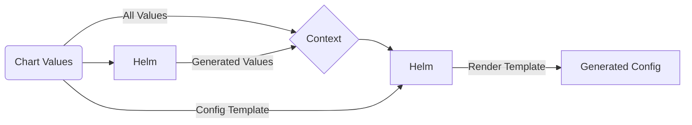

# Proxyd Helm Chart

Deploy and scale [proxyd](https://github.com/ethereum-optimism/optimism/tree/develop/proxyd) inside Kubernetes with ease

[](https://opensource.org/licenses/Apache-2.0)   

## Chart Features

- Actively maintained by [GraphOps](https://graphops.xyz) and contributors
- Strong security defaults (non-root execution, ready-only root filesystem, drops all capabilities)
- Readiness checks to ensure traffic only hits `Pod`s that are healthy and ready to serve requests
- Support for `ServiceMonitor`s to configure Prometheus to scrape metrics ([prometheus-operator](https://github.com/prometheus-operator/prometheus-operator))
- Support for configuring Grafana dashboards ([grafana](https://github.com/grafana/helm-charts/tree/main/charts/grafana))

## Quickstart

To install the chart with the release name `my-release`:

```console
$ helm repo add graphops http://graphops.github.io/helm-charts
$ helm install my-release graphops/proxyd
```

The load balanced JSON-RPC endpoint is available at `<release-name>-proxyd:8545` by default.

## Configuring proxyd

### JSON-RPC Backends and Backend Groups

Backends are the blockchain nodes that will sit behind proxyd and answer requests. When defining a backend, you will need to provide a URL, and assign it to a set of backend groups.

The Chart configures 3 backend groups by default:
- `pruned` - nodes that have pruned state
- `archive` - nodes that have full archival state, but may not have trace data
- `archive-trace` - nodes that have full archival state including trace data

Example:
```yaml
backends:
  erigon-pruned-0:
    enabled: true
    rpcUrl: http://eth-mainnet-pruned-0-erigon-rpcdaemons.ethereum:8545
    extraConfig: {}
    groups:
      - pruned
  erigon-pruned-1:
    enabled: true
    rpcUrl: http://eth-mainnet-pruned-1-erigon-rpcdaemons.ethereum:8545
    extraConfig: {}
    groups:
      - pruned
  erigon-archive-trace-0:
    enabled: true
    rpcUrl: http://eth-mainnet-archive-trace-0-erigon-rpcdaemons.ethereum:8545
    extraConfig: {}
    groups:
      - pruned
      - archive
      - archive-trace
  external-with-basic-auth:
    enabled: true
    rpcUrl: http://some-externa-service-that-requires-http-basic-auth
    extraConfig:
      username: your_username
      password: your_password
    groups:
      - pruned
      - archive
```

### JSON-RPC Method Mappings

You can use your own groups by customising the mapping of RPC method name to backend group.

The `rpcMethodMappings` key in [Values](#Values) is used to:

- Define which JSON-RPC methods are allowed (anything not on the list will be rejected)
- Define which backend group should be used to handle each method

### Advanced Configuration

This Chart uses a template to allow customisation of the configuration passed into the application. The template is rendered by Helm, so you can use [Go templating](https://golangdocs.com/templates-in-golang) as well as [Helm context built-ins](https://helm.sh/docs/chart_template_guide/builtin_objects) to customise the configuration. This includes accessing and looping over any values that you pass into the Helm release.

The template is defined under the `configTemplate` key in the [Values](#Values). You can override this value to specify your custom template.

The Chart also generates additional values that are appended to the template context under the `generated` key. You can use these in your template too. See more below.

This diagram describes how this template is used to generate of the output configuration.



### Generated Template Variables

These can be used in the `configTemplate`.

- `.generated.backendGroups` - a `dict` of `group_name -> [backend1, backend2, backend3]`

## Upgrading

We recommend that you pin the version of the Chart that you deploy. You can use the `--version` flag with `helm install` and `helm upgrade` to specify a chart version constraint.

This project uses [Semantic Versioning](https://semver.org/). Changes to the version of the application (the `appVersion`) that the Chart deploys will generally result in a patch version bump for the Chart. Breaking changes to the Chart or its `values.yaml` interface will be reflected with a major version bump.

We do not recommend that you upgrade the application by overriding `image.tag`. Instead, use the version of the Chart that is built for your desired `appVersion`.

## Values

| Key | Type | Default | Description |
|-----|------|---------|-------------|
| backends.example-backend | object | `{"enabled":false,"extraConfig":{},"groups":["pruned","archive","archive-trace"],"rpcUrl":"http://your-node:8545"}` | Example backend configuration, keep disabled |
| backends.example-backend.enabled | bool | `false` | Enable the backend |
| backends.example-backend.extraConfig | object | `{}` | Define additional configuration keys for the backend (see [proxyd config](https://github.com/ethereum-optimism/optimism/blob/5d309e6a6d5e1ef6a88c1ce827b7e6d47f033bbb/proxyd/example.config.toml#L47)) |
| backends.example-backend.groups | list | `["pruned","archive","archive-trace"]` | Define which backend groups the backend is part of |
| backends.example-backend.rpcUrl | string | `"http://your-node:8545"` | Define the JSON-RPC URL for the backend |
| configTemplate | string | See default template in [values.yaml](values.yaml) | The configuration template that is rendered by Helm |
| fullnameOverride | string | `""` |  |
| grafana.dashboards | bool | `false` | Enable creation of Grafana dashboards. [Grafana chart](https://github.com/grafana/helm-charts/tree/main/charts/grafana#grafana-helm-chart) must be configured to search this namespace, see `sidecar.dashboards.searchNamespace` |
| grafana.dashboardsConfigMapLabel | string | `"grafana_dashboard"` | Must match `sidecar.dashboards.label` value for the [Grafana chart](https://github.com/grafana/helm-charts/tree/main/charts/grafana#grafana-helm-chart) |
| grafana.dashboardsConfigMapLabelValue | string | `""` | Must match `sidecar.dashboards.labelValue` value for the [Grafana chart](https://github.com/grafana/helm-charts/tree/main/charts/grafana#grafana-helm-chart) |
| image.pullPolicy | string | `"IfNotPresent"` |  |
| image.repository | string | `"ethereumoptimism/proxyd"` | Image for proxyd |
| image.tag | string | Chart.appVersion | Overrides the image tag |
| imagePullSecrets | list | `[]` | Pull secrets required to fetch the Image |
| nameOverride | string | `""` |  |
| prometheus.serviceMonitors.enabled | bool | `false` | Enable monitoring by creating `ServiceMonitor` CRDs ([prometheus-operator](https://github.com/prometheus-operator/prometheus-operator)) |
| prometheus.serviceMonitors.interval | string | `nil` |  |
| prometheus.serviceMonitors.labels | object | `{}` |  |
| prometheus.serviceMonitors.relabelings | list | `[]` |  |
| prometheus.serviceMonitors.scrapeTimeout | string | `nil` |  |
| proxyd.affinity | object | `{}` |  |
| proxyd.affinityPresets.antiAffinityByHostname | bool | `true` | Configure anti-affinity rules to prevent multiple instances on the same host |
| proxyd.extraArgs | list | `[]` | Additional CLI arguments to pass to `proxyd` |
| proxyd.nodeSelector | object | `{}` |  |
| proxyd.podAnnotations | object | `{}` | Annotations for the `Pod` |
| proxyd.podSecurityContext | object | `{"fsGroup":101337,"runAsGroup":101337,"runAsNonRoot":true,"runAsUser":101337}` | Pod-wide security context |
| proxyd.resources | object | `{}` |  |
| proxyd.service.ports.http-jsonrpc | int | `8545` | Service Port to expose JSON-RPC interface on |
| proxyd.service.type | string | `"ClusterIP"` |  |
| proxyd.terminationGracePeriodSeconds | int | `60` | Amount of time to wait before force-killing the proxyd process |
| proxyd.tolerations | list | `[]` |  |
| rpcMethodMappings | object | `{"eth_blockNumber":"archive","eth_call":"archive","eth_chainId":"pruned","trace_block":"archive-trace"}` | Mapping JSON-RPC method name to a particular group of backends (method_name -> group_name) |
| serviceAccount.annotations | object | `{}` | Annotations to add to the service account |
| serviceAccount.create | bool | `true` | Specifies whether a service account should be created |
| serviceAccount.name | string | `""` | The name of the service account to use. If not set and create is true, a name is generated using the fullname template |

## Contributing

We welcome and appreciate your contributions! Please see the [Contributor Guide](/CONTRIBUTING.md), [Code Of Conduct](/CODE_OF_CONDUCT.md) and [Security Notes](/SECURITY.md) for this repository.
