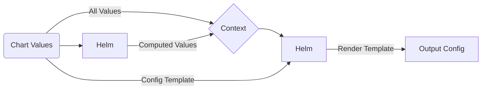

# Proxyd Helm Chart

Deploy and scale [proxyd](https://github.com/ethereum-optimism/optimism/tree/develop/proxyd) inside Kubernetes with ease

[](https://opensource.org/licenses/Apache-2.0)   

## Introduction

[Proxyd](https://github.com/ethereum-optimism/optimism/tree/develop/proxyd) is an EVM-blockchain JSON-RPC router and load balancer developed in Go by [Optimism](https://www.optimism.io/). It is capable of load balancing, automatic failover, intelligent request routing and very basic caching.

## Chart Features

- Actively maintained by [GraphOps](https://graphops.xyz) [and contributors](https://github.com/graphops/launchpad-charts/graphs/contributors)
- Strong security defaults (non-root execution, ready-only root filesystem, drops all capabilities)
- Readiness checks to ensure traffic only hits `Pod`s that are healthy and ready to serve requests
- Support for `ServiceMonitor`s to configure Prometheus to scrape metrics ([prometheus-operator](https://github.com/prometheus-operator/prometheus-operator))
- Support for configuring Grafana dashboards ([grafana](https://github.com/grafana/helm-charts/tree/main/charts/grafana))
- Preconfigured RPC method mappings for pruned, archive and archive trace nodes

## Quickstart

To install the chart with the release name `my-release`:

```console
$ helm repo add graphops http://graphops.github.io/launchpad-charts
$ helm install my-release graphops/proxyd
```

The load balanced JSON-RPC endpoint is available at `<release-name>-proxyd:8545` by default.

## Configuring proxyd

### JSON-RPC Backends and Backend Groups

Backends are the blockchain nodes that will sit behind proxyd and answer requests. When defining a backend, you will need to provide a URL, and assign it to a set of backend groups.

The Chart configures 3 backend groups by default:
- `pruned` - nodes that have pruned state
- `archive` - nodes that have full archival state, but may not have trace data
- `archive-trace` - nodes that have full archival state including trace data

You should assign your backends to the groups that make sense.

**You must have at least one node in every group that is defined.**

Example:

```yaml
backends:
  erigon-pruned-0:
    enabled: true
    rpcUrl: http://eth-mainnet-pruned-0-erigon-rpcdaemon.ethereum:8545
    groups:
      - pruned
  erigon-pruned-1:
    enabled: true
    rpcUrl: http://eth-mainnet-pruned-1-erigon-rpcdaemon.ethereum:8545
    groups:
      - pruned
  erigon-archive-trace-0:
    enabled: true
    rpcUrl: http://eth-mainnet-archive-trace-0-erigon-rpcdaemon.ethereum:8545
    groups:
      - pruned
      - archive
      - archive-trace
  external-with-basic-auth:
    enabled: true
    rpcUrl: http://some-externa-service-that-requires-http-basic-auth
    extraConfig:
      username: your_username
      password: your_password
    groups:
      - pruned
      - archive
```

You can use your own backend groups by customising the RPC Method Mappings.

### JSON-RPC Method Mappings

RPC Method Mappings (see [Values](#Values)) are used to:

- Define which JSON-RPC methods are allowed (anything not on the list will be rejected)
- Define which backend group should be used to handle each method

These mappings are pre-configured for the default backend groups, but you can change them if you want to use different groups or customise the routing behaviour.

### Advanced Configuration

This Chart uses a template to allow customisation of the configuration passed into the application. The template is rendered by Helm, so you can use [Go templating](https://golangdocs.com/templates-in-golang) as well as [Helm context built-ins](https://helm.sh/docs/chart_template_guide/builtin_objects) to customise the configuration. This includes accessing and looping over any values that you pass into the Helm release.

The template is defined under the `configTemplate` key in the [Values](#Values). You can override this value to specify your custom template.

The Chart also computes additional values that are appended to the template context. You can use these in your template too. See more below.

This diagram describes how this template is used to generate of the output configuration.



### Computed Template Variables

The following additional template variables are computed and injected into the template context under the `computed` key:

- `backendGroups` - a `dict` of `group_name -> [backend1_name, backend2_name, backend3_name]`

You can use these keys in your custom configuration template (e.g. `{{ .computed.computedValue }}`).

## Upgrading

We recommend that you pin the version of the Chart that you deploy. You can use the `--version` flag with `helm install` and `helm upgrade` to specify a chart version constraint.

This project uses [Semantic Versioning](https://semver.org/). Changes to the version of the application (the `appVersion`) that the Chart deploys will generally result in a patch version bump for the Chart. Breaking changes to the Chart or its `values.yaml` interface will be reflected with a major version bump.

We do not recommend that you upgrade the application by overriding `image.tag`. Instead, use the version of the Chart that is built for your desired `appVersion`.

## Values

| Key | Description | Type | Default |
|-----|-------------|------|---------|
 | backends.example-backend | Example backend configuration, keep disabled | object | `{"enabled":false,"extraConfig":{},"groups":["pruned","archive","archive-trace"],"rpcUrl":"http://your-node:8545"}` |
 | backends.example-backend.enabled | Enable the backend | bool | `false` |
 | backends.example-backend.extraConfig | Define additional configuration keys for the backend (see [proxyd config](https://github.com/ethereum-optimism/optimism/blob/5d309e6a6d5e1ef6a88c1ce827b7e6d47f033bbb/proxyd/example.config.toml#L47)) | object | `{}` |
 | backends.example-backend.groups | Define which backend groups the backend is part of | list | `["pruned","archive","archive-trace"]` |
 | backends.example-backend.rpcUrl | Define the JSON-RPC URL for the backend | string | `"http://your-node:8545"` |
 | configTemplate | The configuration template that is rendered by Helm | string | See default template in [values.yaml](values.yaml) |
 | fullnameOverride |  | string | `""` |
 | grafana.dashboards | Enable creation of Grafana dashboards. [Grafana chart](https://github.com/grafana/helm-charts/tree/main/charts/grafana#grafana-helm-chart) must be configured to search this namespace, see `sidecar.dashboards.searchNamespace` | bool | `false` |
 | grafana.dashboardsConfigMapLabel | Must match `sidecar.dashboards.label` value for the [Grafana chart](https://github.com/grafana/helm-charts/tree/main/charts/grafana#grafana-helm-chart) | string | `"grafana_dashboard"` |
 | grafana.dashboardsConfigMapLabelValue | Must match `sidecar.dashboards.labelValue` value for the [Grafana chart](https://github.com/grafana/helm-charts/tree/main/charts/grafana#grafana-helm-chart) | string | `"1"` |
 | image.pullPolicy |  | string | `"IfNotPresent"` |
 | image.repository | Image for proxyd | string | `"ethereumoptimism/proxyd"` |
 | image.tag | Overrides the image tag | string | Chart.appVersion |
 | imagePullSecrets | Pull secrets required to fetch the Image | list | `[]` |
 | nameOverride |  | string | `""` |
 | prometheus.serviceMonitors.enabled | Enable monitoring by creating `ServiceMonitor` CRDs ([prometheus-operator](https://github.com/prometheus-operator/prometheus-operator)) | bool | `false` |
 | prometheus.serviceMonitors.interval |  | string | `nil` |
 | prometheus.serviceMonitors.labels |  | object | `{}` |
 | prometheus.serviceMonitors.relabelings |  | list | `[]` |
 | prometheus.serviceMonitors.scrapeTimeout |  | string | `nil` |
 | proxyd.affinity |  | object | `{}` |
 | proxyd.affinityPresets.antiAffinityByHostname | Configure anti-affinity rules to prevent multiple instances on the same host | bool | `true` |
 | proxyd.configTemplating.enabled | Enables config templating from the values. If set to false, must provide an existing ConfigMap | bool | `true` |
 | proxyd.existingConfigMap | Name of an existing ConfigMap with proxyd configuration. proxyd.configTemplating.enable must be set to false | string | `""` |
 | proxyd.extraArgs | Additional CLI arguments to pass to `proxyd` | list | `[]` |
 | proxyd.nodeSelector |  | object | `{}` |
 | proxyd.podAnnotations | Annotations for the `Pod` | object | `{}` |
 | proxyd.podSecurityContext | Pod-wide security context | object | `{"fsGroup":101337,"runAsGroup":101337,"runAsNonRoot":true,"runAsUser":101337}` |
 | proxyd.resources |  | object | `{}` |
 | proxyd.service.ports.http-jsonrpc | Service Port to expose JSON-RPC interface on | int | `8545` |
 | proxyd.service.ports.http-metrics | Service Port to expose Prometheus metrics on | int | `9761` |
 | proxyd.service.type |  | string | `"ClusterIP"` |
 | proxyd.terminationGracePeriodSeconds | Amount of time to wait before force-killing the proxyd process | int | `60` |
 | proxyd.tolerations |  | list | `[]` |
 | rpcMethodMappings | Mapping JSON-RPC method name to a particular group of backends (method_name -> group_name) | object | `{"eth_blockNumber":"pruned","eth_call":"archive","eth_chainId":"pruned","eth_coinbase":"pruned","eth_estimateGas":"pruned","eth_feeHistory":"pruned","eth_gasPrice":"pruned","eth_getBalance":"pruned","eth_getBlockByHash":"pruned","eth_getBlockByNumber":"pruned","eth_getBlockTransactionCountByHash":"pruned","eth_getBlockTransactionCountByNumber":"pruned","eth_getCode":"pruned","eth_getFilterChanges":"pruned","eth_getLogs":"pruned","eth_getStorageAt":"pruned","eth_getTransactionByBlockHashAndIndex":"archive","eth_getTransactionByBlockNumberAndIndex":"archive","eth_getTransactionByHash":"archive","eth_getTransactionCount":"pruned","eth_getTransactionReceipt":"archive","eth_getUncleByBlockHashAndIndex":"pruned","eth_getUncleByBlockNumberAndIndex":"pruned","eth_newBlockFilter":"pruned","eth_newFilter":"pruned","eth_newPendingTransactionFilter":"pruned","eth_protocolVersion":"pruned","eth_sendRawTransaction":"pruned","eth_sendTransaction":"pruned","eth_sign":"pruned","eth_uninstallFilter":"pruned","net_version":"pruned","trace_block":"archive-trace","trace_call":"archive-trace","trace_callMany":"archive-trace","trace_filter":"archive-trace","trace_rawTransaction":"archive-trace","trace_replayBlockTransactions":"archive-trace","trace_replayTransaction":"archive-trace","trace_transaction":"archive-trace","web3_clientVersion":"pruned","web3_sha3":"pruned"}` |
 | serviceAccount.annotations | Annotations to add to the service account | object | `{}` |
 | serviceAccount.create | Specifies whether a service account should be created | bool | `true` |
 | serviceAccount.name | The name of the service account to use. If not set and create is true, a name is generated using the fullname template | string | `""` |

## Contributing

We welcome and appreciate your contributions! Please see the [Contributor Guide](/CONTRIBUTING.md), [Code Of Conduct](/CODE_OF_CONDUCT.md) and [Security Notes](/SECURITY.md) for this repository.
