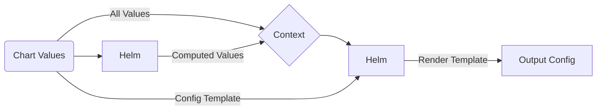

# Proxyd Helm Chart

Deploy and scale [proxyd](https://github.com/ethereum-optimism/infra/tree/main/proxyd) inside Kubernetes with ease

[](https://opensource.org/licenses/Apache-2.0)   

## Introduction

[Proxyd](https://github.com/ethereum-optimism/infra/tree/main/proxyd) is an EVM-blockchain JSON-RPC router and load balancer developed in Go by [Optimism](https://www.optimism.io/). It is capable of load balancing, automatic failover, intelligent request routing and very basic caching.

## Chart Features

- Actively maintained by [GraphOps](https://graphops.xyz) [and contributors](https://github.com/graphops/launchpad-charts/graphs/contributors)
- Strong security defaults (non-root execution, ready-only root filesystem, drops all capabilities)
- Readiness checks to ensure traffic only hits `Pod`s that are healthy and ready to serve requests
- Support for `ServiceMonitor`s to configure Prometheus to scrape metrics ([prometheus-operator](https://github.com/prometheus-operator/prometheus-operator))
- Support for configuring Grafana dashboards ([grafana](https://github.com/grafana/helm-charts/tree/main/charts/grafana))
- Preconfigured RPC method mappings for pruned, archive and archive trace nodes

## Quickstart

To install the chart with the release name `my-release`:

```console
$ helm repo add graphops http://graphops.github.io/launchpad-charts
$ helm install my-release graphops/proxyd
```

The load balanced JSON-RPC endpoint is available at `<release-name>-proxyd:8545` by default.

## Configuring proxyd

### JSON-RPC Backends and Backend Groups

Backends are the blockchain nodes that will sit behind proxyd and answer requests. When defining a backend, you will need to provide a URL, and assign it to a set of backend groups.

The Chart configures 3 backend groups by default:
- `pruned` - nodes that have pruned state
- `archive` - nodes that have full archival state, but may not have trace data
- `archive-trace` - nodes that have full archival state including trace data

You should assign your backends to the groups that make sense.

**You must have at least one node in every group that is defined.**

Example:

```yaml
backends:
  erigon-pruned-0:
    enabled: true
    rpcUrl: http://eth-mainnet-pruned-0-erigon-rpcdaemon.ethereum:8545
    groups:
      - pruned
  erigon-pruned-1:
    enabled: true
    rpcUrl: http://eth-mainnet-pruned-1-erigon-rpcdaemon.ethereum:8545
    groups:
      - pruned
  erigon-archive-trace-0:
    enabled: true
    rpcUrl: http://eth-mainnet-archive-trace-0-erigon-rpcdaemon.ethereum:8545
    groups:
      - pruned
      - archive
      - archive-trace
  external-with-basic-auth:
    enabled: true
    rpcUrl: http://some-externa-service-that-requires-http-basic-auth
    extraConfig:
      username: your_username
      password: your_password
    groups:
      - pruned
      - archive
```

You can use your own backend groups by customising the RPC Method Mappings.

### JSON-RPC Method Mappings

RPC Method Mappings (see [Values](#Values)) are used to:

- Define which JSON-RPC methods are allowed (anything not on the list will be rejected)
- Define which backend group should be used to handle each method

These mappings are pre-configured for the default backend groups, but you can change them if you want to use different groups or customise the routing behaviour.

### Advanced Configuration

This Chart uses a template to allow customisation of the configuration passed into the application. The template is rendered by Helm, so you can use [Go templating](https://golangdocs.com/templates-in-golang) as well as [Helm context built-ins](https://helm.sh/docs/chart_template_guide/builtin_objects) to customise the configuration. This includes accessing and looping over any values that you pass into the Helm release.

The template is defined under the `configTemplate` key in the [Values](#Values). You can override this value to specify your custom template.

The Chart also computes additional values that are appended to the template context. You can use these in your template too. See more below.

This diagram describes how this template is used to generate of the output configuration.



### Secret-Driven Config Rendering (envsubst)

When your backend URLs or other config values contain secrets, you can keep them out of Helm values and inject them at runtime using environment variables and an initContainer that renders the final config with `envsubst`.

- Enable rendering: set `proxyd.configTemplating.envsubst.enabled: true` (default).
- The chart mounts the rendered config at `/config/config.toml` and proxyd reads from there.
- Provide env vars to the init container using `proxyd.initContainer.env`, `proxyd.initContainer.envRaw`, or `proxyd.initContainer.envFrom` (e.g., from a Secret). The default image is `bytesco/envsubst:latest`, which includes the `envsubst` binary.
- Optionally enforce presence of variables via `proxyd.configTemplating.envsubst.requiredVars`.

Example:

```yaml
proxyd:
  # Template may include placeholders like ${RPC_USER}:${RPC_PASS}
  configTemplating:
    envsubst:
      enabled: true
      requiredVars: ["RPC_USER", "RPC_PASS"]

  initContainer:
    envFrom:
      - secretRef:
          name: my-rpc-credentials

  # Optional: also expose env to main container if needed
  envRaw:
    - name: SOME_FLAG
      value: "1"
```

Notes:
- When `envsubst` is enabled (default), the config `ConfigMap` is mounted as a read-only template and an `emptyDir` is used for the rendered config. Disabling `envsubst` falls back to mounting the `ConfigMap` directly at `/config`.
- For strict security, inject secrets only into the init container via `envFrom` or `envRaw` and avoid exposing them to the main container unless required.

### Computed Template Variables

The following additional template variables are computed and injected into the template context under the `computed` key:

- `backendGroups` - a `dict` of `group_name -> [backend1_name, backend2_name, backend3_name]`

You can use these keys in your custom configuration template (e.g. `{{ .computed.computedValue }}`).

## Upgrading

We recommend that you pin the version of the Chart that you deploy. You can use the `--version` flag with `helm install` and `helm upgrade` to specify a chart version constraint.

This project uses [Semantic Versioning](https://semver.org/). Changes to the version of the application (the `appVersion`) that the Chart deploys will generally result in a patch version bump for the Chart. Breaking changes to the Chart or its `values.yaml` interface will be reflected with a major version bump.

We do not recommend that you upgrade the application by overriding `image.tag`. Instead, use the version of the Chart that is built for your desired `appVersion`.

## Values

| Key | Description | Type | Default |
|-----|-------------|------|---------|
 | backendConfigTemplate | TOML configuration for backend | string | `"# How long proxyd should wait for a backend response before timing out.\nresponse_timeout_seconds = 300\n# Maximum response size, in bytes, that proxyd will accept from a backend.\nmax_response_size_bytes = 10737420000 # 10 GiB\n# Maximum number of times proxyd will try a backend before giving up.\nmax_retries = 3\n# Number of seconds to wait before trying an unhealthy backend again.\nout_of_service_seconds = 10\n"` |
 | backendGroups.routing_strategy | Set the routing strategy (consensus_aware \| multicall \| fallback) | string | `"consensus_aware"` |
 | backendGroups.weighted_routing | Enable weighted routing | bool | `true` |
 | backends.example-backend | Example backend configuration, keep disabled | object | `{"enabled":false,"extraConfig":{},"groups":["main"],"rpcUrl":"http://your-node:8545","weight":1,"wsUrl":"ws://your-node:8545"}` |
 | backends.example-backend.enabled | Enable the backend | bool | `false` |
 | backends.example-backend.extraConfig | Define additional configuration keys for the backend (see [proxyd config](https://github.com/ethereum-optimism/optimism/blob/5d309e6a6d5e1ef6a88c1ce827b7e6d47f033bbb/proxyd/example.config.toml#L47)) | object | `{}` |
 | backends.example-backend.groups | Define which backend groups the backend is part of | list | `["main"]` |
 | backends.example-backend.rpcUrl | Define the JSON-RPC URL for the backend | string | `"http://your-node:8545"` |
 | backends.example-backend.weight | Define an weight for weighted routing | int | `1` |
 | backends.example-backend.wsUrl | Define the JSON-RPC Websocket URL for the backend | string | `"ws://your-node:8545"` |
 | batchConfigTemplate | TOML configuration for batch | string | `"# Set maximum batch size (hard limit of 1000)\nmax_size = {{ .Values.batchMaxSize }}\n"` |
 | batchMaxSize | Max batch size (hard limit is 1000) | int | `250` |
 | cacheConfigTemplate | TOML configuration for cache | string | `"# Whether or not to enable caching.\nenabled = {{ .Values.cacheEnabled }}\n"` |
 | cacheEnabled | Enable caching | bool | `false` |
 | configTemplate | The configuration template that is rendered by Helm | string | See default template in [values.yaml](values.yaml) |
 | fullnameOverride |  | string | `""` |
 | grafana.dashboards | Enable creation of Grafana dashboards. [Grafana chart](https://github.com/grafana/helm-charts/tree/main/charts/grafana#grafana-helm-chart) must be configured to search this namespace, see `sidecar.dashboards.searchNamespace` | bool | `false` |
 | grafana.dashboardsConfigMapLabel | Must match `sidecar.dashboards.label` value for the [Grafana chart](https://github.com/grafana/helm-charts/tree/main/charts/grafana#grafana-helm-chart) | string | `"grafana_dashboard"` |
 | grafana.dashboardsConfigMapLabelValue | Must match `sidecar.dashboards.labelValue` value for the [Grafana chart](https://github.com/grafana/helm-charts/tree/main/charts/grafana#grafana-helm-chart) | string | `"1"` |
 | grafana.operatorDashboards | Create GrafanaDashboard CRDs via Grafana Operator from files in `dashboards/` | object | `{"allowCrossNamespaceImport":false,"annotations":{},"enabled":false,"extraSpec":{"datasources":[{"datasourceName":"datasource","inputName":"prometheus"},{"datasourceName":"loki_datasource","inputName":"loki"}]},"folder":"blockchain","folderUID":"","instanceSelector":{"matchLabels":{}},"labels":{},"namespace":"","resyncPeriod":"","suspend":false,"uid":"proxyd-overview-v90"}` |
 | grafana.operatorDashboards.allowCrossNamespaceImport | Allow matching Grafana instances outside current namespace | bool | `false` |
 | grafana.operatorDashboards.extraSpec | Additional spec fields to merge into GrafanaDashboard.spec | object | `{"datasources":[{"datasourceName":"datasource","inputName":"prometheus"},{"datasourceName":"loki_datasource","inputName":"loki"}]}` |
 | grafana.operatorDashboards.folder | Optional folder metadata | string | `"blockchain"` |
 | grafana.operatorDashboards.instanceSelector | Selector to match Grafana instances managed by the operator | object | `{"matchLabels":{}}` |
 | grafana.operatorDashboards.labels | Extra labels and annotations on the GrafanaDashboard resources | object | `{}` |
 | grafana.operatorDashboards.namespace | Optional target namespace for the GrafanaDashboard CRDs (defaults to release namespace) | string | `""` |
 | grafana.operatorDashboards.resyncPeriod | Operator sync behavior | string | `""` |
 | image.pullPolicy |  | string | `"IfNotPresent"` |
 | image.repository | Image for proxyd | string | `"us-docker.pkg.dev/oplabs-tools-artifacts/images/proxyd"` |
 | image.tag | Overrides the image tag | string | Chart.appVersion |
 | imagePullSecrets | Pull secrets required to fetch the Image | list | `[]` |
 | metricsConfigTemplate | TOML configuration for metrics | string | `"# Whether or not to enable Prometheus metrics.\nenabled = true\n# Host for the Prometheus metrics endpoint to listen on.\nhost = \"0.0.0.0\"\n# Port for the above.\nport = 9761\n"` |
 | nameOverride |  | string | `""` |
 | prometheus.serviceMonitors.enabled | Enable monitoring by creating `ServiceMonitor` CRDs ([prometheus-operator](https://github.com/prometheus-operator/prometheus-operator)) | bool | `false` |
 | prometheus.serviceMonitors.interval |  | string | `nil` |
 | prometheus.serviceMonitors.labels |  | object | `{}` |
 | prometheus.serviceMonitors.relabelings |  | list | `[]` |
 | prometheus.serviceMonitors.scrapeTimeout |  | string | `nil` |
 | proxyd.affinity |  | object | `{}` |
 | proxyd.affinityPresets.antiAffinityByHostname | Configure anti-affinity rules to prevent multiple instances on the same host | bool | `true` |
 | proxyd.configTemplating.enabled | Enables config templating from the values. If set to false, must provide an existing ConfigMap | bool | `true` |
 | proxyd.configTemplating.envsubst | Runtime envsubst rendering of the generated config (initContainer) | object | `{"enabled":true,"requiredVars":[]}` |
 | proxyd.configTemplating.envsubst.enabled | Enable initContainer-based envsubst of the config | bool | `true` |
 | proxyd.configTemplating.envsubst.requiredVars | Optional list of required env var names; init will fail if any are unset/empty | list | `[]` |
 | proxyd.env | Environment variables for the main proxyd container (simple key-value) | object | `{}` |
 | proxyd.envFrom | envFrom entries for the main container (array of objects, e.g. secretRef/configMapRef) | list | `[]` |
 | proxyd.envRaw | Raw env entries for the main container (use when you need valueFrom, secretKeyRef, etc.) | list | `[]` |
 | proxyd.existingConfigMap | Name of an existing ConfigMap with proxyd configuration. proxyd.configTemplating.enable must be set to false | string | `""` |
 | proxyd.extraArgs | Additional CLI arguments to pass to `proxyd` | list | `[]` |
 | proxyd.initContainer | Init container configuration used for config rendering | object | `{"env":{},"envFrom":[],"envRaw":[],"image":{"pullPolicy":"IfNotPresent","repository":"bytesco/envsubst","tag":"latest"}}` |
 | proxyd.initContainer.env | Environment variables for the init container (simple key-value) | object | `{}` |
 | proxyd.initContainer.envFrom | envFrom entries for the init container (array of objects, e.g. secretRef/configMapRef) | list | `[]` |
 | proxyd.initContainer.envRaw | Raw env entries for the init container (when you need valueFrom, secretKeyRef, etc.) | list | `[]` |
 | proxyd.initContainer.image | Container image for envsubst rendering (dedicated envsubst image) | object | `{"pullPolicy":"IfNotPresent","repository":"bytesco/envsubst","tag":"latest"}` |
 | proxyd.nodeSelector |  | object | `{}` |
 | proxyd.podAnnotations | Annotations for the `Pod` | object | `{}` |
 | proxyd.podSecurityContext | Pod-wide security context | object | `{"fsGroup":101337,"runAsGroup":101337,"runAsNonRoot":true,"runAsUser":101337,"seccompProfile":{"type":"RuntimeDefault"}}` |
 | proxyd.replicaCount | Number of replicas | int | `1` |
 | proxyd.resources |  | object | `{}` |
 | proxyd.service.ports.http-jsonrpc | Service Port to expose JSON-RPC interface on | int | `8545` |
 | proxyd.service.ports.http-metrics | Service Port to expose Prometheus metrics on | int | `9761` |
 | proxyd.service.ports.http-ws |  | int | `8546` |
 | proxyd.service.type |  | string | `"ClusterIP"` |
 | proxyd.terminationGracePeriodSeconds | Amount of time to wait before force-killing the proxyd process | int | `60` |
 | proxyd.tolerations |  | list | `[]` |
 | proxyd.ulimitNoFile | Soft nofile limit to set before starting proxyd (0 or empty to skip) | int | `65536` |
 | redisConfigTemplate | TOML configuration for redis | string | `"# URL to a Redis instance.\nurl = {{ .Values.redisUrl \| quote }}\n# Redis namespace to use for keys.\nnamespace = {{ .Values.redisNamespace \| quote }}\n"` |
 | redisEnabled | Enable configuring Redis | bool | `false` |
 | redisNamespace | Redis namespace to use for keys | string | `""` |
 | redisUrl | URL to a Redis instance | string | `""` |
 | rpcMethodMappings | Mapping JSON-RPC method name to a particular group of backends (method_name -> group_name) | object | `{"eth_blobBaseFee":"main","eth_blockNumber":"main","eth_call":"main","eth_chainId":"main","eth_coinbase":"main","eth_estimateGas":"main","eth_feeHistory":"main","eth_gasPrice":"main","eth_getBalance":"main","eth_getBlockByHash":"main","eth_getBlockByNumber":"main","eth_getBlockReceipts":"main","eth_getBlockTransactionCountByHash":"main","eth_getBlockTransactionCountByNumber":"main","eth_getCode":"main","eth_getFilterChanges":"main","eth_getLogs":"main","eth_getStorageAt":"main","eth_getTransactionByBlockHashAndIndex":"main","eth_getTransactionByBlockNumberAndIndex":"main","eth_getTransactionByHash":"main","eth_getTransactionCount":"main","eth_getTransactionReceipt":"main","eth_getUncleByBlockHashAndIndex":"main","eth_getUncleByBlockNumberAndIndex":"main","eth_newBlockFilter":"main","eth_newFilter":"main","eth_newPendingTransactionFilter":"main","eth_protocolVersion":"main","eth_sendRawTransaction":"main","eth_sendTransaction":"main","eth_sign":"main","eth_syncing":"main","eth_uninstallFilter":"main","net_peerCount":"main","net_version":"main","trace_block":"main","trace_call":"main","trace_callMany":"main","trace_filter":"main","trace_rawTransaction":"main","trace_replayBlockTransactions":"main","trace_replayTransaction":"main","trace_transaction":"main","web3_clientVersion":"main","web3_sha3":"main"}` |
 | serverConfigTemplate | TOML configuration for server | string | `"# Host for the proxyd RPC server to listen on\nrpc_host = \"0.0.0.0\"\n# Port for the above.\nrpc_port = 8545\n# Host for the proxyd WebSocket server to listen on\nws_host = \"0.0.0.0\"\n# Port for the above.\nws_port = 8546\n# Maximum client body size, in bytes, that the server will accept\nmax_body_size_bytes = 10737420000 # 10 GiB\n# Maximum number of concurrent RPCs that the server will accept\nmax_concurrent_rpcs = 0 # unlimited\n# Timeout for requests\ntimeout_seconds = 300\n"` |
 | serviceAccount.annotations | Annotations to add to the service account | object | `{}` |
 | serviceAccount.create | Specifies whether a service account should be created | bool | `true` |
 | serviceAccount.name | The name of the service account to use. If not set and create is true, a name is generated using the fullname template | string | `""` |
 | wsBackendGroup | Backend group to use for WebSocket connections | string | `"main"` |
 | wsConfigTemplate | TOML configuration for backend group websockets | string | `"# Backend group to use for WebSocket connections.\nws_backend_group = {{ .Values.wsBackendGroup \| quote }}\n# Method whitelist for WebSocket connections.\nws_method_whitelist = {{ .Values.wsMethodWhitelist \| toJson }}\n"` |
 | wsMethodWhitelist | Method whitelist for WebSocket connections | list | `[]` |

## Contributing

We welcome and appreciate your contributions! Please see the [Contributor Guide](/CONTRIBUTING.md), [Code Of Conduct](/CODE_OF_CONDUCT.md) and [Security Notes](/SECURITY.md) for this repository.
